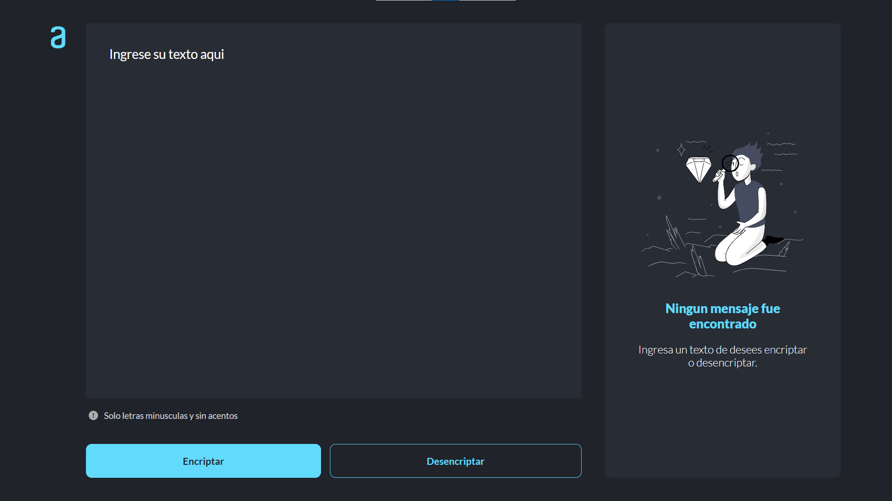
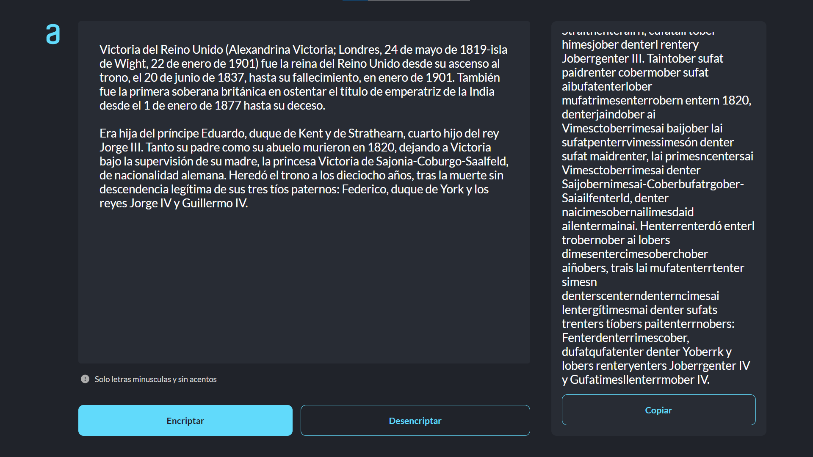
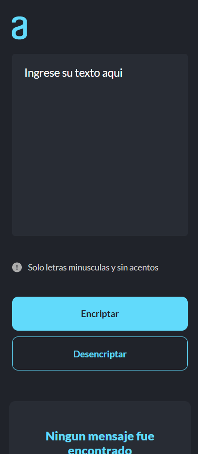
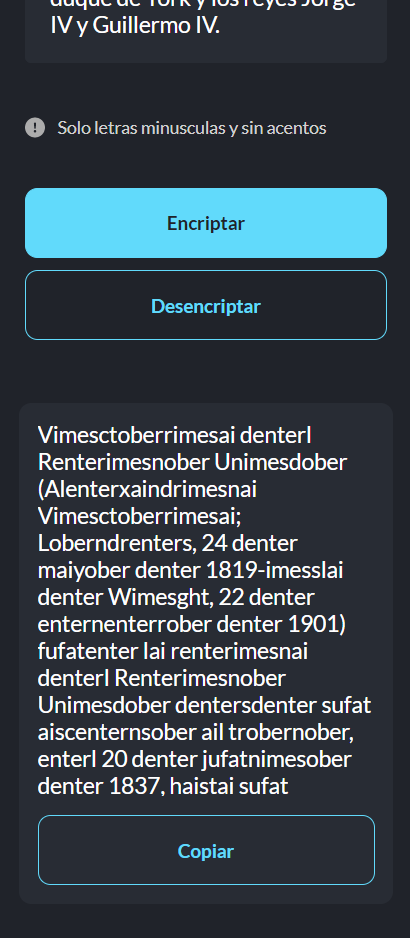

# Text Encryptor

Herramienta para cifrar y decrifrar textos

<a href="https://app.netlify.com/sites/encriptador-typescript-jaenfigueroa/deploys"></img></a>

## 📷 Capturas de pantalla

- ### 💻 Desktop

- ### 📱 Mobile

  
  
  

## 🛠️ Tecnologias usadas

 
  &nbsp;

## 📝 Elementos principales y caracteristicas de la página

- Título de su sitio web
- Campo para el texto que va a ser encriptado/desencriptado
- Un botón para encriptar
- Un botón para desencriptar
- Área para mostrar el texto encriptado/desencriptado
- Boton para copiar el texto resultante de la encriptacion/desencriptacion
- Pagina web responsiva

##  🔠 Fuente de texto

- Lato - https://fonts.google.com/specimen/Lato?vfquery=lato&query=lato

## 🎨 Paleta de colores

## 📖 Diccionario de encriptacion

| Clave  | Valor  |
| :------------: | :------------: |
| a  | ai  |
| e  | enter  |
|  i |  imes |
| o  | ober  |
|  u |  ufat |

## 🌐 Sitio web

Puedes ver el resultado [aqui](https://encriptador-typescript-jaenfigueroa.netlify.app/).

